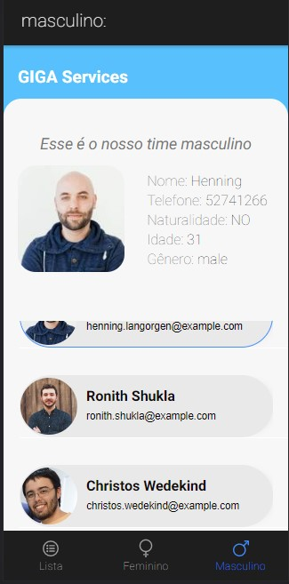

<p align="center">  GIGA Service 🚀</p>

<p align="center">
   
</p>

<p align="center">	
   <a href="https://www.linkedin.com/in/lorison-gilles/">
      
   </a>
  

<a href="https://github.com/Gilles30/challenge-giga/commits/master">

</a>

<a href="https://github.com/Gilles30/challenge-giga/stargazers">

</a>

</p>

> <p align="center"> :rocket: Project created for competency test. </p>

<p align="center">
    <a href="README.md">English</a>
    ·
    <a href="README-pt.md">Portuguese</a>
 </p>

<div align="center">
  <sub>The Users Giga Service. Built with ❤︎ by
    <a href="https://github.com/Gilles30">Lorison Gilles</a> and
    <a href="https://github.com/Gilles30/challenge-giga/">
      contributors
    </a>
  </sub>
</div>

# :pushpin: Table of Contents

- [:pushpin: Table of Contents](#pushpin-table-of-contents)
    - [Web Screenshot and out of scope items](#web-screenshot-and-out-of-scope-items)
    - [pt-br -> Relatório final](#pt-br---relatório-final)
    - [Mobile Screenshot](#mobile-screenshot)
- [:eyes: Demo Website](#eyes-demo-website)
- [:computer: Technologies](#computer-technologies)
- [:rocket: Features](#rocket-features)
- [:construction_worker: How to run](#construction_worker-how-to-run)
    - [📦 Run API](#-run-api)
    - [💻 Run Web Project](#-run-web-project)
- [:bug: Issues](#bug-issues)
- [:tada: Contributing](#tada-contributing)
  - [🤝 Contributing](#-contributing)
- [:closed_book: License](#closed_book-license)

</p>

</br></br>

### Web Screenshot and out of scope items

</br>

<div align="center">

   <p>
    A users page, where we can see the listing by genres.
      We can list different genres through the tabs of the pages.
   </p>
   </br>
   </br></br>
   <p>
    I created an internationalization of the items, being possible, add a switch with the chosen countries, later.
   </p>

   <p>
    By clicking on the user we can see his detail just above the page
   </p>
   </br>
   <p>
    I chose the possibility of having three pages with a completely different layout, if allowed, greater freedom of UX and UI in the development 
   </p>
   
</div>
</br>

### pt-br -> Relatório final

 <h3>Soluções implementadas</h3>
 </br>
 <p>O projeto foi criado do zero, onde foi surgindo algumas possibilidades de melhorias, e uma que implementei foi a internacionalização do app, onde apliquei as configurações do i18n, deixando o projeto pronto para implementar o botão de troca de idioma. Foi implementado uma animação em uma tela como splashscreen.
 </p>
 </br></br>
 <h3>Dificuldade e Desafios</h3>
 <p>Um dos maiores desafios, foi durante o desenvolvimento ir encontrando e aprendendo a aplicar as soluções com as tecnologias determinadas</p>
 <p>Uma das maiores dificuldades que esbarrei foi a ausencia de exemplos ou documentações atuais, (cobertas por atualizações) da configuração ideal para aplicar no cordova, onde por esse motivo não consegui eliminar um erro no build da compilação do APK, onde deixo de apresentar. </p>

### Mobile Screenshot

<div align="center">
  
  </br></br>
   
   </br></br>
   
   </br></br>
   
</div>

# :eyes: Demo Website

You can acess the website at:  
👉 demo:

 

# :computer: Technologies

This project was made using the follow technologies:

- [Typescript](https://www.typescriptlang.org/)
- [Angular 12+](https://angular.io/)
- [Ionic 6](https://ionicframework.com/docs/)
- [Cordova](https://prettier.io/)
- [i18n](https://www.i18next.com/)
- [angular/language-service](https://angular.io/guide/language-service)
- [Jest](https://jestjs.io/)

# :rocket: Features

- All User listing.
- Female user listing.
- Male user slinsting.
- Detail users.

# :construction_worker: How to run

```bash
# Clone Repository
$ git clone https://github.com/Gilles30/challenge-giga.git
```

### 📦 Run API

- API consumed directly from the cloud!

```bash
# Routes and Endpoint
$ https://randomuser.me/api/

# Object Typing
$ exemple/.json {
  "results": [
    {
      "gender": "male",
      "name": {
        "title": "Mr",
        "first": "Almar",
        "last": "Mollink"
      },
      "location": {
        "street": {
          "number": 7054,
          "name": "Hovenierssteeg"
        },
        "city": "'s-Graveland",
        "state": "Noord-Holland",
        "country": "Netherlands",
        "postcode": "1134 BM",
        "coordinates": {
          "latitude": "32.7256",
          "longitude": "-36.9272"
        },
        "timezone": {
          "offset": "+2:00",
          "description": "Kaliningrad, South Africa"
        }
      },
      "email": "almar.mollink@example.com",
      "login": {
        "uuid": "078bc0a3-c5c6-42b1-bb54-eaabdb5100c6",
        "username": "greenfish901",
        "password": "random",
        "salt": "XwXAkRhS",
        "md5": "ed6ded35574e6ae7348796b009e41f83",
        "sha1": "5b852f267f35eb8eb138b81990891f0e2c672404",
        "sha256": "654227db578901c93a17b2acca71b792fbfd375057feb1489f6cf95d1def6095"
      },
      "dob": {
        "date": "1981-09-26T08:03:50.226Z",
        "age": 41
      },
      "registered": {
        "date": "2015-10-22T11:53:43.100Z",
        "age": 7
      },
      "phone": "(0527) 432252",
      "cell": "(06) 34783414",
      "id": {
        "name": "BSN",
        "value": "02430180"
      },
      "picture": {
        "large": "https://randomuser.me/api/portraits/men/71.jpg",
        "medium": "https://randomuser.me/api/portraits/med/men/71.jpg",
        "thumbnail": "https://randomuser.me/api/portraits/thumb/men/71.jpg"
      },
      "nat": "NL"
    }
  ],
  "info": {
    "seed": "9efd9555c3b50938",
    "results": 1,
    "page": 1,
    "version": "1.4"
  }
}
```

Access docs API at https://randomuser.me/documentation

### 💻 Run Web Project

```bash
# Go to web folder
$ cd challenge-giga


# Install Dependencies (Only if you haven't installed the dependencies before)
$ npm i

# Run Aplication
$ npm run start

```

Go to http://localhost:42000

# :bug: Issues

Feel free to **file a new issue** with a respective title and description on the the [Proffy](https://github.com/Gilles30/challenge-giga
/issues) repository. If you already found a solution to your problem, **i would love to review your pull request**!

# :tada: Contributing

Check out the [contributing](./CONTRIBUTING.md) page to see the best places to file issues, start discussions and begin contributing.

## 🤝 Contributing

Follow the steps below to contribute:

1.  _fork_ the project (<https://github.com/Gilles30/challenge-giga

    > )

2.  Clone your _fork_ to your machine (`git clone https://github.com/Gilles30/challenge-giga .git`)

3.  Create a _branch_ to carry out your modification (`git checkout -b feature/name_new_feature`)

4.  Add your modifications and do the _commit_ (`git commit -m "Descreva sua modificação"`)

5.  _Push_ (`git push origin feature/name_new_feature`)

6.  Create a new _Pull Request_

7.  Okay, now just wait for the analysis 🚀

# :closed_book: License

Released in 2022 :closed_book: License

Made with love by [Lorison Gilles](https://github.com/Gilles30) 🚀.
This project is under the [MIT license](./LICENSE).

Give a ⭐️ if this project helped you!
